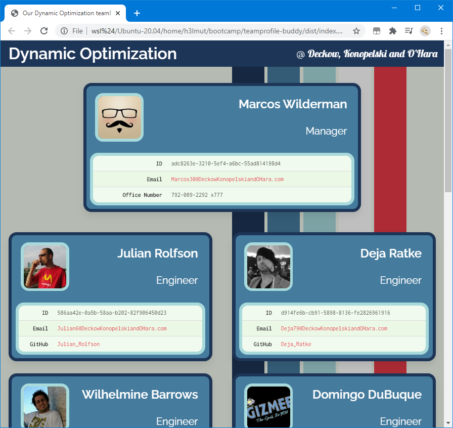

# teamprofileBuddy

## Description

---

Generate a team profile page (like [this sample](docs/sample/index.html)) effortlessly from the command line, after answering a couple of simple questions. See it in action [here](https://youtu.be/dTPfas1c91c)

## Installation

---

- Clone this repository && run 'npm install'

## Usage

---

- Run 'npm run build' or 'bin/cli.js' from the package directory.
- If you want to use it within node, index.js exposes a simple module interface with methods to gather input (either from inquirer or randomly generated test/sample data), and run webpack with the appropriate configuration.
- If you want to skip the questions and fill the template in with sample data, run 'npm run build:dev' (or 'bin/cli.js' after setting NODE_ENV to development). Alternately, 'npm start:dev' will run webpack-dev-server with hot reloading (defaults to listening on port 8080)

## License

---

Copyright 2020 gminteer@gmail.com

Licensed under the Apache-2.0 License (the "License");
you may not use this file except in compliance with the License.
You may obtain a copy of the License at

<http://opensource.org/licenses/Apache-2.0>

Unless required by applicable law or agreed to in writing, software
distributed under the License is distributed on an "AS IS" BASIS,
WITHOUT WARRANTIES OR CONDITIONS OF ANY KIND, either express or implied.
See the License for the specific language governing permissions and
limitations under the License.

## Tests

---

Unit tests have been implemented -- 'npm run test' will run the test suite once, 'npm run test:watch' will stay running and re-run the test suite whenever any of the files that have unit tests have been changed.

